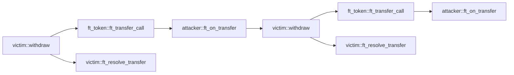

## Reentrancy

### Konfiguration

* Detektor-ID: `reentrancy`
* Schweregrad: hoch

### Beschreibung

Finden Sie Funktionen, die anfällig für Reentrancy-Angriffe sind.

Verträge sollten immer ihren Zustand ändern, bevor sie einen Cross-Contract-Aufruf tätigen, und die Änderungen in der Callback-Funktion rückgängig machen, wenn der Cross-Contract-Aufruf fehlschlägt.

### Beispielcode

Hier ist ein Beispiel für einen Reentrancy-Angriff. Der Opfervertrag aktualisiert den Zustand (d. h. `attacker_balance`) in der Funktion `ft_resolve_transfer` erst nach erfolgreicher Übertragung an den Angreifer.

Der Opfervertrag ruft `ft_token::ft_transfer_call` auf, um Token zu übertragen, was nach der internen Übertragung den `ft_on_transfer` des Angreifers aufruft.

Wenn jedoch der `ft_on_transfer` des Angreifers den `withdraw` des Opfers erneut aufruft, wird das Opfer erneut an den Angreifer übertragen, da der Zustand (d. h. `attacker_balance`) noch nicht geändert wurde.

Das Aufrufdiagramm ist:



Angreifervertrag:

```rust
#[near_bindgen]
impl MaliciousContract {
    pub fn ft_on_transfer(&mut self, amount: u128) {
        if self.reentered == false {
            ext_victim::withdraw(
                amount.into(),
                &VICTIM,
                0,
                env::prepaid_gas() - GAS_FOR_SINGLE_CALL,
            );
        }
        self.reentered = true;
    }
}

```

FT-Vertrag:

```rust
#[near_bindgen]
impl FungibleToken {
    pub fn ft_transfer_call(&mut self, amount: u128) -> PromiseOrValue<U128> {
        // Interner Transfer
        self.attacker_balance += amount;
        self.victim_balance -= amount;

        ext_fungible_token_receiver::ft_on_transfer(
            amount.into(),
            &ATTACKER,
            0,
            env::prepaid_gas() - GAS_FOR_SINGLE_CALL,
        )
        .into()
    }
}
```

Opfervertrag:

```rust
#[near_bindgen]
impl VictimContract {
    pub fn withdraw(&mut self, amount: u128) -> Promise {
        assert!(self.attacker_balance >= amount);
        ext_ft_token::ft_transfer_call(
            amount.into(),
            &FT_TOKEN,
            0,
            env::prepaid_gas() - GAS_FOR_SINGLE_CALL * 2,
        ).then(ext_self::ft_resolve_transfer(
            amount.into(),
            &env::current_account_id(),
            0,
            GAS_FOR_SINGLE_CALL,
        ))
    }

    #[private]
    pub fn ft_resolve_transfer(&mut self, amount: u128) {
        match env::promise_result(0) {
            PromiseResult::NotReady => unreachable!(),
            PromiseResult::Successful(_) => {
                self.attacker_balance -= amount;
            }
            PromiseResult::Failed => {}
        };
    }
}
```

Die korrekte Implementierung besteht darin, den Zustand vor dem Aufruf einer externen Funktion zu ändern und den Zustand nur dann wiederherzustellen, wenn das Promise fehlschlägt.

```rust
#[near_bindgen]
impl VictimContract {
    pub fn withdraw(&mut self, amount: u128) -> Promise {
        assert!(self.attacker_balance >= amount);
        self.attacker_balance -= amount;
        ext_ft_token::ft_transfer_call(
            amount.into(),
            &FT_TOKEN,
            0,
            env::prepaid_gas() - GAS_FOR_SINGLE_CALL * 2,
        ).then(ext_self::ft_resolve_transfer(
            amount.into(),
            &env::current_account_id(),
            0,
            GAS_FOR_SINGLE_CALL,
        ))
    }

    #[private]
    pub fn ft_resolve_transfer(&mut self, amount: u128) {
        match env::promise_result(0) {
            PromiseResult::NotReady => unreachable!(),
            PromiseResult::Successful(_) => {}
            PromiseResult::Failed => {
                self.attacker_balance += amount;
            }
        };
    }
}
```
