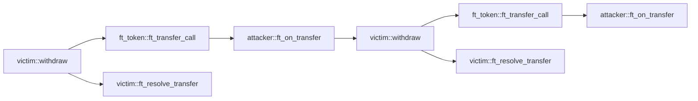

## Réentrance

### Configuration

* identifiant du détecteur : `reentrancy`
* gravité : élevée

### Description

Trouvez les fonctions qui sont vulnérables aux attaques par réentrance.

Les contrats doivent toujours changer d'état avant de faire une invocation inter-contrats et annuler les changements dans la fonction de rappel si l'invocation inter-contrats échoue.

### Exemple de code

Voici un exemple d'attaque par réentrance. Le contrat victime met à jour l'état (c'est-à-dire `attacker_balance`) dans la fonction `ft_resolve_transfer` seulement après avoir transféré avec succès vers l'attaquant.

Le contrat victime invoque `ft_token::ft_transfer_call` pour transférer des jetons, ce qui va appeler le `ft_on_transfer` de l'attaquant après le transfert interne.

Cependant, si le `ft_on_transfer` de l'attaquant invoque à nouveau le `withdraw` de la victime, la victime transférera de nouveau vers l'attaquant puisque l'état (c'est-à-dire `attacker_balance`) n'a pas encore été modifié.

Le graphe d'appel est :



Contrat de l'attaquant :

```rust
#[near_bindgen]
impl MaliciousContract {
    pub fn ft_on_transfer(&mut self, amount: u128) {
        if self.reentered == false {
            ext_victim::withdraw(
                amount.into(),
                &VICTIM,
                0,
                env::prepaid_gas() - GAS_FOR_SINGLE_CALL,
            );
        }
        self.reentered = true;
    }
}

```

Contrat FT :

```rust
#[near_bindgen]
impl FungibleToken {
    pub fn ft_transfer_call(&mut self, amount: u128) -> PromiseOrValue<U128> {
        // transfert interne
        self.attacker_balance += amount;
        self.victim_balance -= amount;

        ext_fungible_token_receiver::ft_on_transfer(
            amount.into(),
            &ATTACKER,
            0,
            env::prepaid_gas() - GAS_FOR_SINGLE_CALL,
        )
        .into()
    }
}
```

Contrat de la victime :

```rust
#[near_bindgen]
impl VictimContract {
    pub fn withdraw(&mut self, amount: u128) -> Promise {
        assert!(self.attacker_balance >= amount);
        ext_ft_token::ft_transfer_call(
            amount.into(),
            &FT_TOKEN,
            0,
            env::prepaid_gas() - GAS_FOR_SINGLE_CALL * 2,
        ).then(ext_self::ft_resolve_transfer(
            amount.into(),
            &env::current_account_id(),
            0,
            GAS_FOR_SINGLE_CALL,
        ))
    }

    #[private]
    pub fn ft_resolve_transfer(&mut self, amount: u128) {
        match env::promise_result(0) {
            PromiseResult::NotReady => unreachable!(),
            PromiseResult::Successful(_) => {
                self.attacker_balance -= amount;
            }
            PromiseResult::Failed => {}
        };
    }
}
```

La mise en œuvre correcte consiste à modifier l'état avant d'appeler une fonction externe et à restaurer l'état seulement si la promesse échoue.

```rust
#[near_bindgen]
impl VictimContract {
    pub fn withdraw(&mut self, amount: u128) -> Promise {
        assert!(self.attacker_balance >= amount);
        self.attacker_balance -= amount;
        ext_ft_token::ft_transfer_call(
            amount.into(),
            &FT_TOKEN,
            0,
            env::prepaid_gas() - GAS_FOR_SINGLE_CALL * 2,
        ).then(ext_self::ft_resolve_transfer(
            amount.into(),
            &env::current_account_id(),
            0,
            GAS_FOR_SINGLE_CALL,
        ))
    }

    #[private]
    pub fn ft_resolve_transfer(&mut self, amount: u128) {
        match env::promise_result(0) {
            PromiseResult::NotReady => unreachable!(),
            PromiseResult::Successful(_) => {}
            PromiseResult::Failed => {
                self.attacker_balance += amount;
            }
        };
    }
}
```
