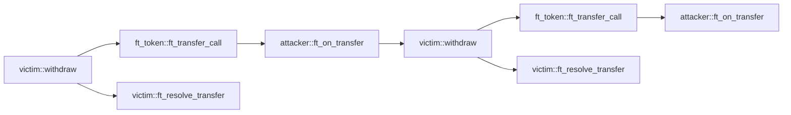

## 重入性问题

### 配置项

* 检测器标识：重入性
* 严重等级：高

### 描述

发现那些容易遭受重入攻击的函数。

合约在执行跨合约调用前，应当先改变状态，并且如果跨合约调用失败，应在回调函数中撤销之前的状态变更。

### 示例代码

以下是一个重入攻击的例子。受害合约只有在成功向攻击者转账之后，才在函数ft_resolve_transfer中更新状态（例如attacker_balance）。

受害合约调用ft_token::ft_transfer_call执行代币转账，在内部转账完成后，将会触发攻击者的ft_on_transfer函数。

但是，如果攻击者的ft_on_transfer再次调用受害合约的withdraw方法，由于状态（即attacker_balance）还未更新，受害合约会再次向攻击者转账。

调用关系图如下：



攻击者合约：

```rust
#[near_bindgen]
impl MaliciousContract {
    pub fn ft_on_transfer(&mut self, amount: u128) {
        if self.reentered == false {
            ext_victim::withdraw(
                amount.into(),
                &VICTIM,
                0,
                env::prepaid_gas() - GAS_FOR_SINGLE_CALL,
            );
        }
        self.reentered = true;
    }
}

```

FT合约：

```rust
#[near_bindgen]
impl FungibleToken {
    pub fn ft_transfer_call(&mut self, amount: u128) -> PromiseOrValue<U128> {
        // internal transfer
        self.attacker_balance += amount;
        self.victim_balance -= amount;

        ext_fungible_token_receiver::ft_on_transfer(
            amount.into(),
            &ATTACKER,
            0,
            env::prepaid_gas() - GAS_FOR_SINGLE_CALL,
        )
        .into()
    }
}
```

受害合约：

```rust
#[near_bindgen]
impl VictimContract {
    pub fn withdraw(&mut self, amount: u128) -> Promise {
        assert!(self.attacker_balance >= amount);
        ext_ft_token::ft_transfer_call(
            amount.into(),
            &FT_TOKEN,
            0,
            env::prepaid_gas() - GAS_FOR_SINGLE_CALL * 2,
        ).then(ext_self::ft_resolve_transfer(
            amount.into(),
            &env::current_account_id(),
            0,
            GAS_FOR_SINGLE_CALL,
        ))
    }

    #[private]
    pub fn ft_resolve_transfer(&mut self, amount: u128) {
        match env::promise_result(0) {
            PromiseResult::NotReady => unreachable!(),
            PromiseResult::Successful(_) => {
                self.attacker_balance -= amount;
            }
            PromiseResult::Failed => {}
        };
    }
}
```

正确的做法是在调用外部函数之前先改变状态，并且只有在异步调用（Promise）失败时才恢复之前的状态。

```rust
#[near_bindgen]
impl VictimContract {
    pub fn withdraw(&mut self, amount: u128) -> Promise {
        assert!(self.attacker_balance >= amount);
        self.attacker_balance -= amount;
        ext_ft_token::ft_transfer_call(
            amount.into(),
            &FT_TOKEN,
            0,
            env::prepaid_gas() - GAS_FOR_SINGLE_CALL * 2,
        ).then(ext_self::ft_resolve_transfer(
            amount.into(),
            &env::current_account_id(),
            0,
            GAS_FOR_SINGLE_CALL,
        ))
    }

    #[private]
    pub fn ft_resolve_transfer(&mut self, amount: u128) {
        match env::promise_result(0) {
            PromiseResult::NotReady => unreachable!(),
            PromiseResult::Successful(_) => {}
            PromiseResult::Failed => {
                self.attacker_balance += amount;
            }
        };
    }
}
```
