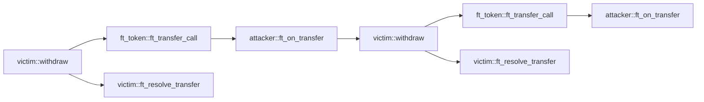

## Reentrancy

### 配置

* 检测器 ID：`reentrancy`
* 严重程度：高

### 描述

查找容易受到重入攻击的函数。

合约应始终在进行跨合约调用之前更改状态，并在跨合约调用失败时，在回调函数中回滚这些更改。

### 示例代码

以下是一个重入攻击的例子。受害者合约只有在成功向攻击者转账后，才在函数 `ft_resolve_transfer` 中更新状态（即 `attacker_balance`）。

受害者合约调用 `ft_token::ft_transfer_call` 来转移代币，该调用在内部转账完成后会触发攻击者的 `ft_on_transfer`。

然而，如果攻击者的 `ft_on_transfer` 再次调用受害者的 `withdraw`，由于状态（即 `attacker_balance`）尚未更新，受害者将再次向攻击者转账。

调用图为：



攻击者合约：

```rust
#[near_bindgen]
impl MaliciousContract {
    pub fn ft_on_transfer(&mut self, amount: u128) {
        if !self.reentered {
            ext_victim::withdraw(
                amount.into(),
                &VICTIM,
                0,
                env::prepaid_gas() - GAS_FOR_SINGLE_CALL,
            );
        }
        self.reentered = true;
    }
}

```

FT 合约：

```rust
#[near_bindgen]
impl FungibleToken {
    pub fn ft_transfer_call(&mut self, amount: u128) -> PromiseOrValue<U128> {
        // 内部转账
        self.attacker_balance += amount;
        self.victim_balance -= amount;

        ext_fungible_token_receiver::ft_on_transfer(
            amount.into(),
            &ATTACKER,
            0,
            env::prepaid_gas() - GAS_FOR_SINGLE_CALL,
        )
        .into()
    }
}
```

受害者合约：

```rust
#[near_bindgen]
impl VictimContract {
    pub fn withdraw(&mut self, amount: u128) -> Promise {
        assert!(self.attacker_balance >= amount);
        ext_ft_token::ft_transfer_call(
            amount.into(),
            &FT_TOKEN,
            0,
            env::prepaid_gas() - GAS_FOR_SINGLE_CALL * 2,
        ).then(ext_self::ft_resolve_transfer(
            amount.into(),
            &env::current_account_id(),
            0,
            GAS_FOR_SINGLE_CALL,
        ))
    }

    #[private]
    pub fn ft_resolve_transfer(&mut self, amount: u128) {
        match env::promise_result(0) {
            PromiseResult::NotReady => unreachable!(),
            PromiseResult::Successful(_) => {
                self.attacker_balance -= amount;
            }
            PromiseResult::Failed => {}
        };
    }
}
```

正确的实现应该是在调用外部函数之前更改状态，并且只有在 Promise 失败时才恢复状态。

```rust
#[near_bindgen]
impl VictimContract {
    pub fn withdraw(&mut self, amount: u128) -> Promise {
        assert!(self.attacker_balance >= amount);
        self.attacker_balance -= amount;
        ext_ft_token::ft_transfer_call(
            amount.into(),
            &FT_TOKEN,
            0,
            env::prepaid_gas() - GAS_FOR_SINGLE_CALL * 2,
        ).then(ext_self::ft_resolve_transfer(
            amount.into(),
            &env::current_account_id(),
            0,
            GAS_FOR_SINGLE_CALL,
        ))
    }

    #[private]
    pub fn ft_resolve_transfer(&mut self, amount: u128) {
        match env::promise_result(0) {
            PromiseResult::NotReady => unreachable!(),
            PromiseResult::Successful(_) => {}
            PromiseResult::Failed => {
                self.attacker_balance += amount;
            }
        };
    }
}
```
