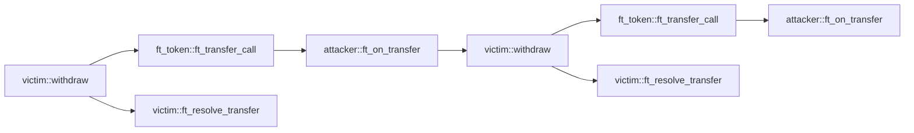

## Reentrancy

### Configuration

* detector id: `reentrancy`
* severity: high

### 説明

リエントランシー攻撃に対して脆弱な関数を検出します。

コントラクトは、クロスコントラクト呼び出しを行う前に常に状態を変更し、そのクロスコントラクト呼び出しが失敗した場合はコールバック関数で変更をロールバックする必要があります。

### サンプルコード

以下はリエントランシー攻撃の一例です。被害者コントラクトは、攻撃者への送金が成功した後にのみ、関数 `ft_resolve_transfer` 内で状態（つまり `attacker_balance`）を更新します。

被害者コントラクトは `ft_token::ft_transfer_call` を呼び出してトークンを転送しますが、これにより内部転送後に攻撃者の `ft_on_transfer` が呼び出されます。

しかし、攻撃者の `ft_on_transfer` が被害者の `withdraw` を再度呼び出すと、状態（つまり `attacker_balance`）がまだ変更されていないため、被害者は再び攻撃者に送金します。

コールグラフは以下の通りです：



攻撃者コントラクト：

```rust
#[near_bindgen]
impl MaliciousContract {
    pub fn ft_on_transfer(&mut self, amount: u128) {
        if !self.reentered {
            ext_victim::withdraw(
                amount.into(),
                &VICTIM,
                0,
                env::prepaid_gas() - GAS_FOR_SINGLE_CALL,
            );
        }
        self.reentered = true;
    }
}

```

FTコントラクト：

```rust
#[near_bindgen]
impl FungibleToken {
    pub fn ft_transfer_call(&mut self, amount: u128) -> PromiseOrValue<U128> {
        // 内部転送
        self.attacker_balance += amount;
        self.victim_balance -= amount;

        ext_fungible_token_receiver::ft_on_transfer(
            amount.into(),
            &ATTACKER,
            0,
            env::prepaid_gas() - GAS_FOR_SINGLE_CALL,
        )
        .into()
    }
}
```

被害者コントラクト：

```rust
#[near_bindgen]
impl VictimContract {
    pub fn withdraw(&mut self, amount: u128) -> Promise {
        assert!(self.attacker_balance >= amount);
        ext_ft_token::ft_transfer_call(
            amount.into(),
            &FT_TOKEN,
            0,
            env::prepaid_gas() - GAS_FOR_SINGLE_CALL * 2,
        ).then(ext_self::ft_resolve_transfer(
            amount.into(),
            &env::current_account_id(),
            0,
            GAS_FOR_SINGLE_CALL,
        ))
    }

    #[private]
    pub fn ft_resolve_transfer(&mut self, amount: u128) {
        match env::promise_result(0) {
            PromiseResult::NotReady => unreachable!(),
            PromiseResult::Successful(_) => {
                self.attacker_balance -= amount;
            }
            PromiseResult::Failed => {}
        };
    }
}
```

正しい実装では、外部関数を呼び出す前に状態を変更し、Promise が失敗した場合のみ状態を復元します。

```rust
#[near_bindgen]
impl VictimContract {
    pub fn withdraw(&mut self, amount: u128) -> Promise {
        assert!(self.attacker_balance >= amount);
        self.attacker_balance -= amount;
        ext_ft_token::ft_transfer_call(
            amount.into(),
            &FT_TOKEN,
            0,
            env::prepaid_gas() - GAS_FOR_SINGLE_CALL * 2,
        ).then(ext_self::ft_resolve_transfer(
            amount.into(),
            &env::current_account_id(),
            0,
            GAS_FOR_SINGLE_CALL,
        ))
    }

    #[private]
    pub fn ft_resolve_transfer(&mut self, amount: u128) {
        match env::promise_result(0) {
            PromiseResult::NotReady => unreachable!(),
            PromiseResult::Successful(_) => {}
            PromiseResult::Failed => {
                self.attacker_balance += amount;
            }
        };
    }
}
```
